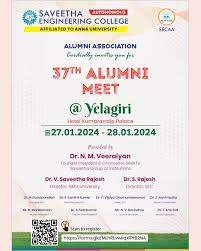
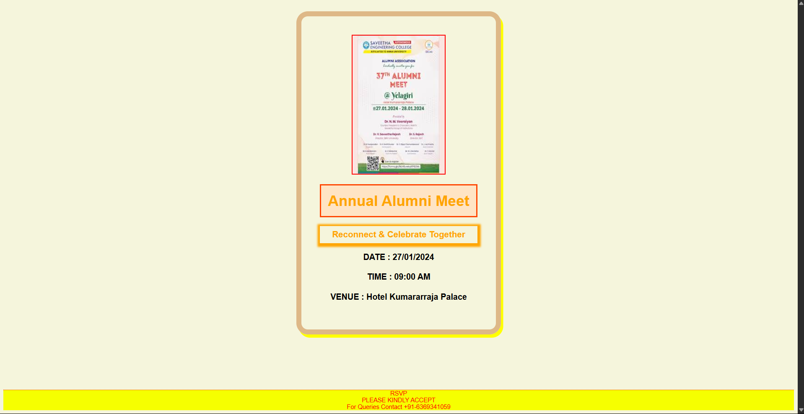

# Event_Invitation
## HTML CODE:

```
<!DOCTYPE html>
<html lang="en">
<head>
    <meta charset="UTF-8">
    <meta name="viewport" content="width=device-width, initial-scale=1.0">
    <link rel="stylesheet" href="style.css">
    <title>Event Invitation</title>
</head>
<body>
    
    <div class="invite-card">
        

    
    <h1>Annual Alumni Meet</h1>
    <h3>Reconnect & Celebrate Together</h3>
    <p>DATE : 27/01/2024</p>   
    <p>TIME : 09:00 AM</p>
    <p>VENUE : Hotel Kumararraja Palace</p> 
    </div>
    <footer>
        RSVP
        <br>
        PLEASE KINDLY ACCEPT <br>
        For Queries Contact +91-6369341059
    </footer>
</body>
</html>
```

## OUTPUT:


## RESUT:
A visually appealing event invitation using HTML elements and basic CSS styling for structure and layout was designed.